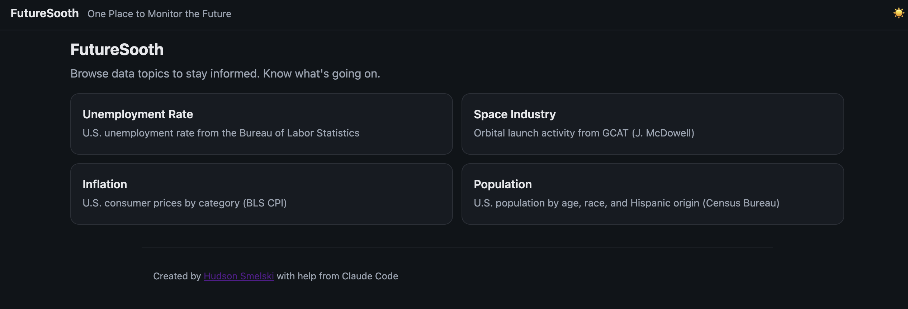
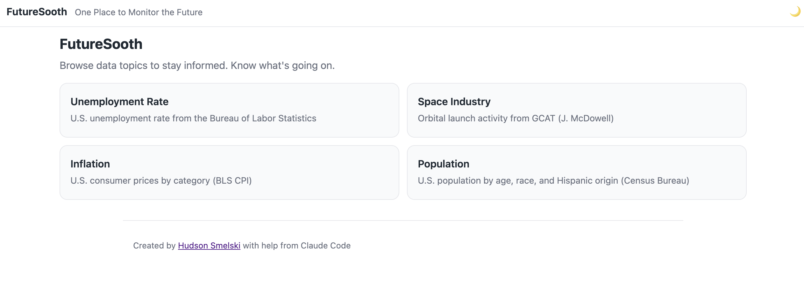
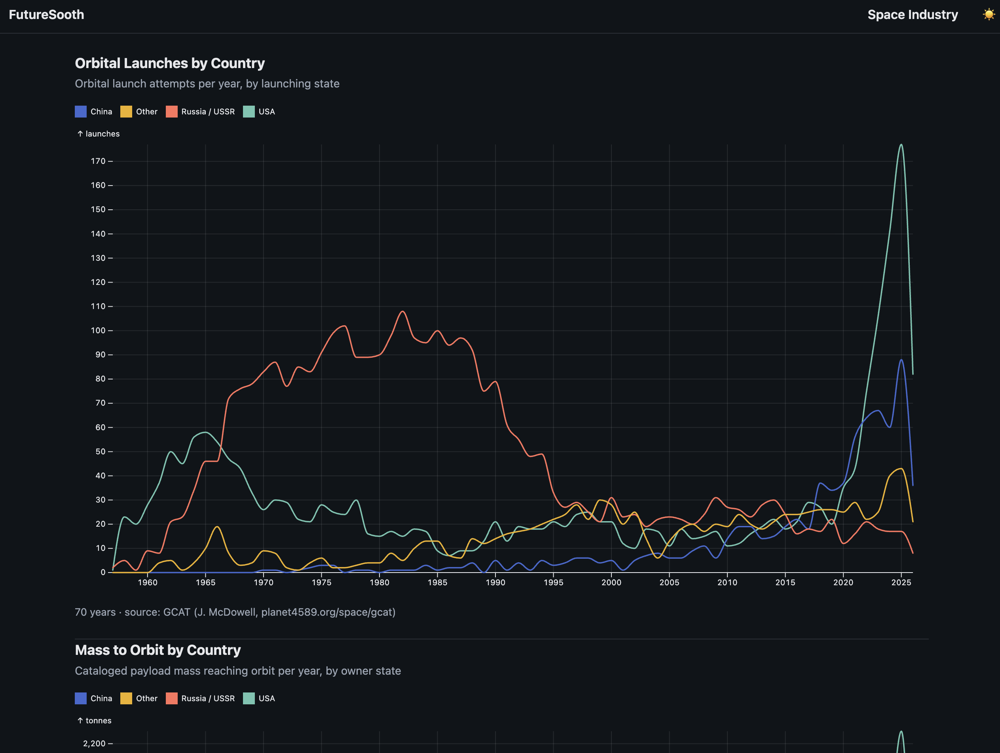
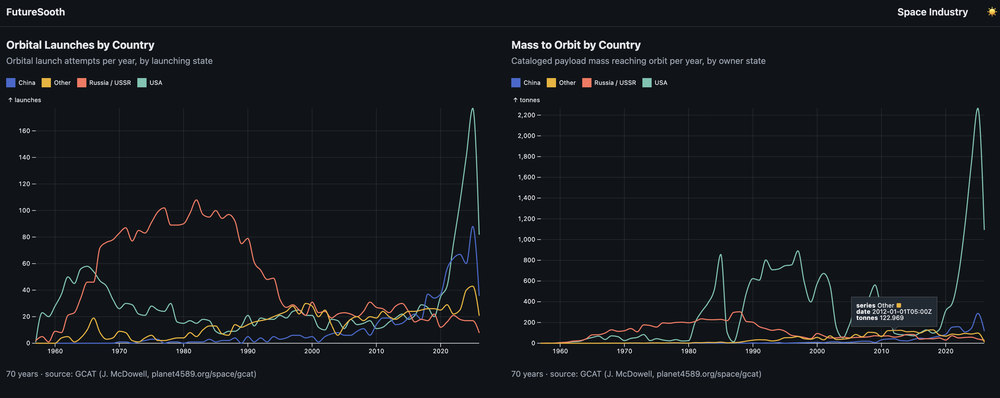
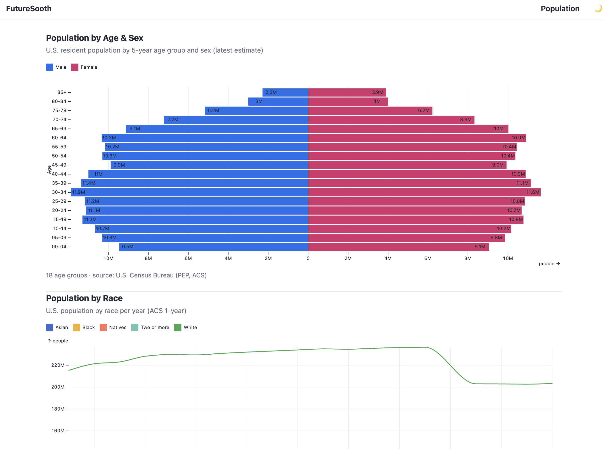

# futuresooth

One place to monitor all the data that matters and pertains to the future. 
A small, dependency-free Go project in two parts:

- **API service** (`cmd/server`) — aggregates data from various open and government sources, 
  merges related series and serves them as clean **chart-ready JSON**. 
  Also writes descriptive per-view JSON + spreadsheet-friendly CSV files.

- **Web service** (`cmd/web`) — a responsive web app that renders the
  charts with [Observable Plot](https://observablehq.com/plot/).




Datasets:

- **Unemployment Rate** — U.S. unemployment (overall + by sex, race/ethnicity,
  and age), monthly, full history back to 1948, from the
  [Bureau of Labor Statistics](https://www.bls.gov/).
- **Inflation** — U.S. consumer prices (CPI-U) by category, split into volatile
  (food, energy, transport) and sticky (housing, medical, education) groups,
  each rebased to 100 at a common month for comparison, from the
  [Bureau of Labor Statistics](https://www.bls.gov/).
- **Space Industry** — worldwide orbital launch activity (launches by country,
  mass to orbit by country, and launch outcomes), yearly since 1957, from
  [GCAT](https://planet4589.org/space/gcat) — Jonathan McDowell's General Catalog
  of Artificial Space Objects (CC-BY; cite as
  *data from GCAT (J. McDowell, planet4589.org/space/gcat)*).
- **Population** — U.S. population as an age/sex pyramid (PEP) plus population by
  race and by Hispanic origin over time (ACS 1-year), from the
  [Census Bureau](https://www.census.gov/) (requires `CENSUS_API_KEY`).





## Configuration

Settings are split by concern across two files in the working directory:

- **`.config`** — non-secret settings, committed.
- **`.env`** — secrets, gitignored (create it yourself; never commit).

A real environment variable overrides either. Create `.env`:

```
BLS_API_KEY=your_key_here    # free at https://data.bls.gov/registrationEngine/
CENSUS_API_KEY=your_key_here # free at https://api.census.gov/data/key_signup.html
ADMIN_TOKEN=your_key_here.   # configure your web service for secure communication
```

| Variable           | File      | Default                 | Service | Meaning                                   |
| ------------------ | --------- | ----------------------- | ------- | ----------------------------------------- |
| `BLS_API_KEY`      | `.env`    | _(none)_                | api     | BLS v2 key                     |
| `CENSUS_API_KEY`   | `.env`    | _(none)_                | api     | Census Bureau API Key                     |
| `ADMIN_TOKEN`      | `.env`    | _(none)_                | api     | Enables `POST /admin/refresh` if set      |
| `HTTP_ADDR`        | `.config` | `:8080`                 | api     | API listen address                        |
| `DATA_DIR`         | `.config` | `./data`                | api     | Where to cache data                       |
| `REFRESH_INTERVAL` | `.config` | `360h`                  | api     | How often to re-pull series               |
| `START_YEAR`       | `.config` | `1948`                  | api     | First year of history (end = this year)   |
| `FRONTEND_ADDR`    | `.config` | `:3000`                 | web     | Web UI listen address                     |
| `BACKEND_URL`      | `.config` | `http://localhost:8080` | web     | API base URL the web UI fetches from      |

## Run

```sh
go run ./cmd/server
go run ./cmd/web

# then open http://localhost:3000 in your browser
```

## Extending (TODO)

### For Now
- **More data** add more series and data sources that matter
- **Forecasting** add linear regression and time series forcasting models to predict trends
- **Charts** chart controls and rendering high quality versions for easy copy/paste
- **Data Format** compressed binary data format for efficient data transfer

### For Later
- Native **iOS** client
- Native **Android** client
- Native **Windows** client
- Native **Mac** client
